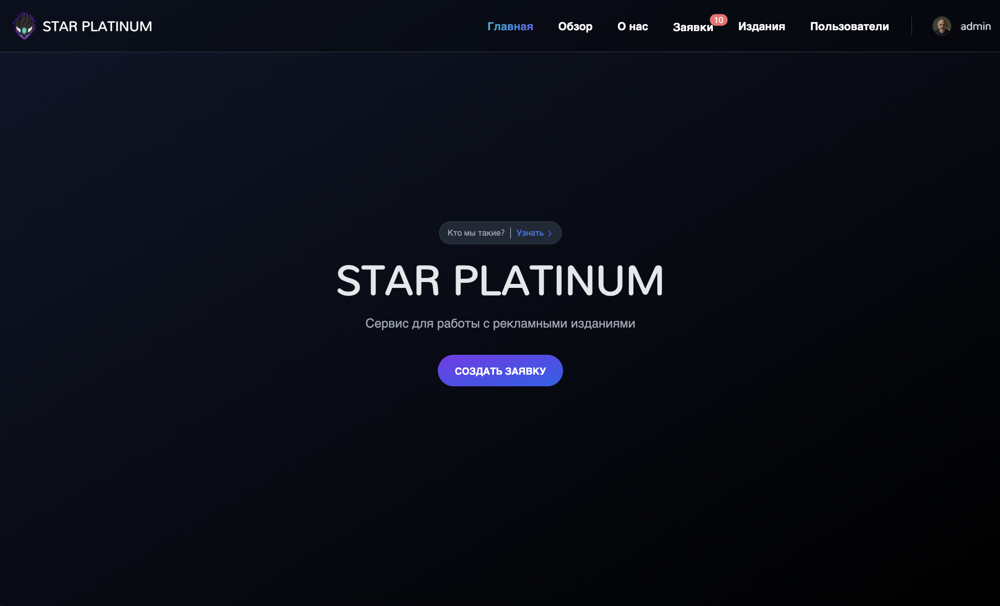
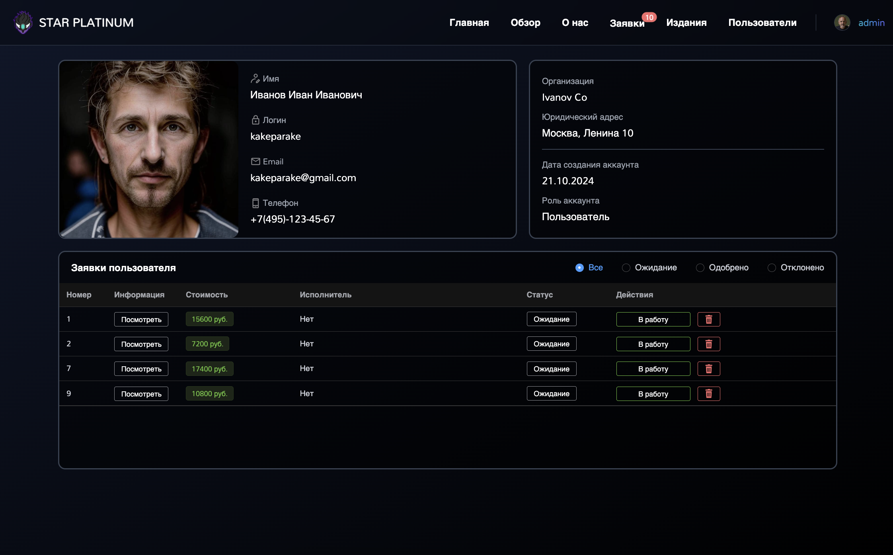
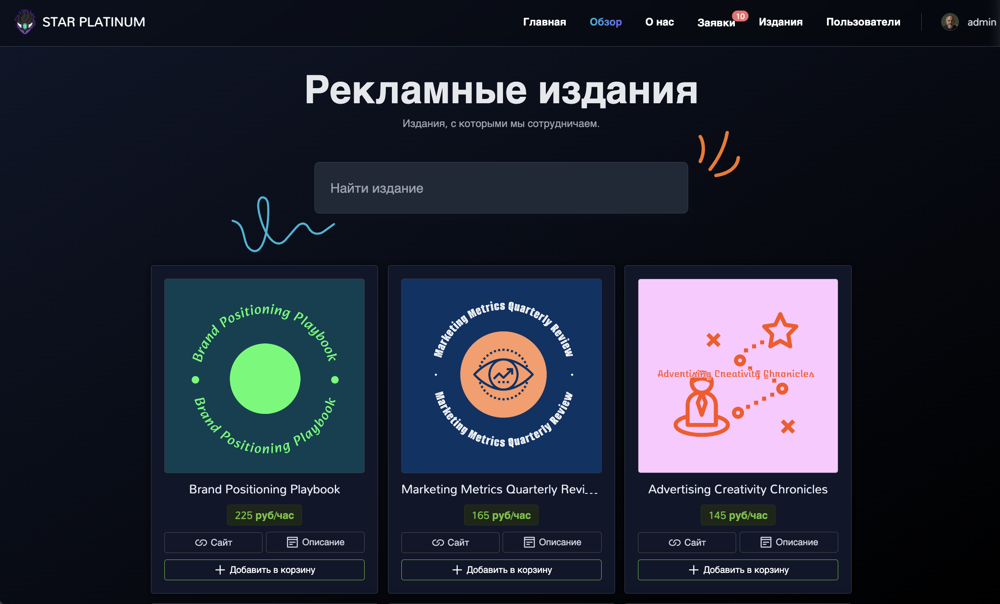
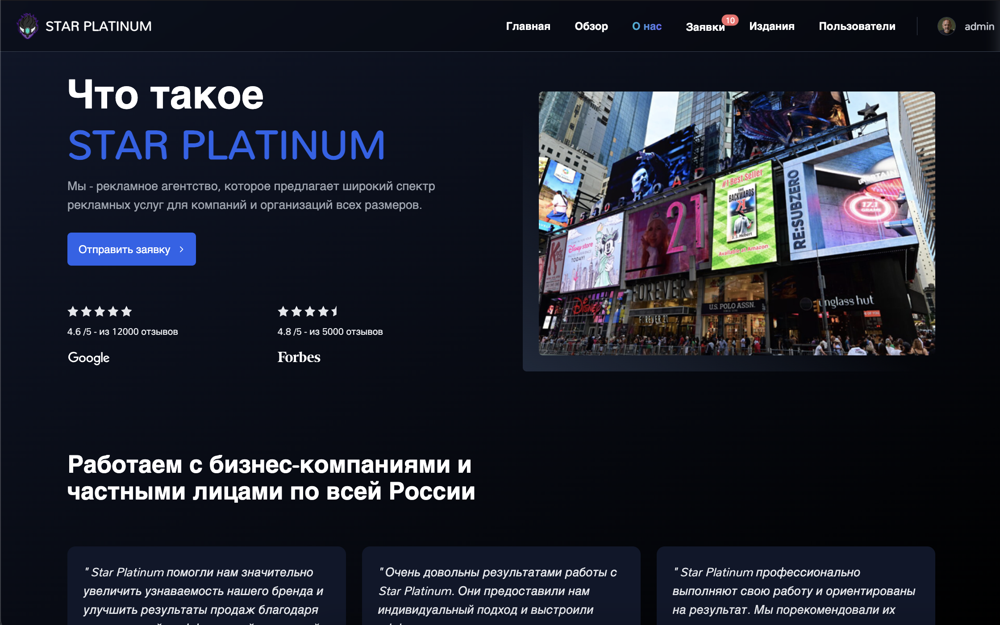
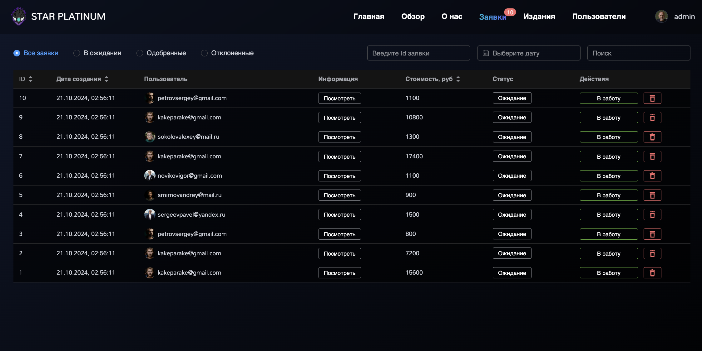
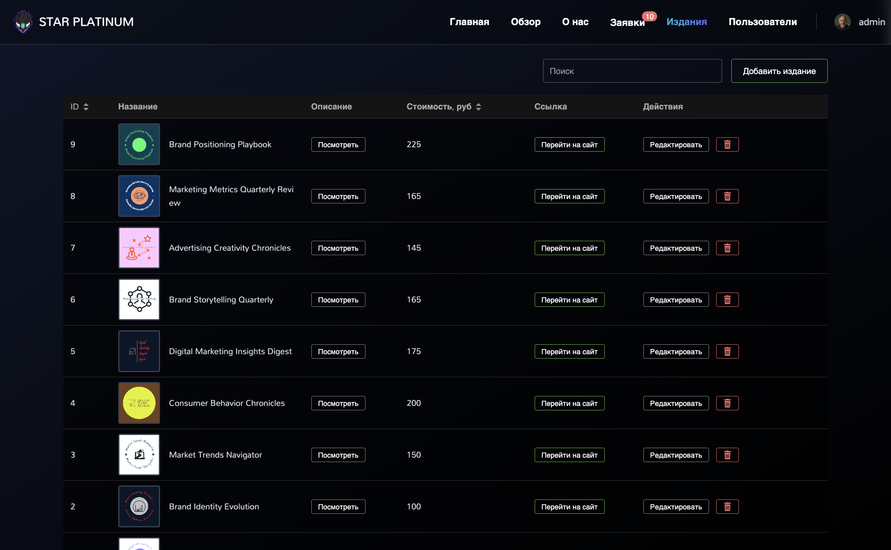
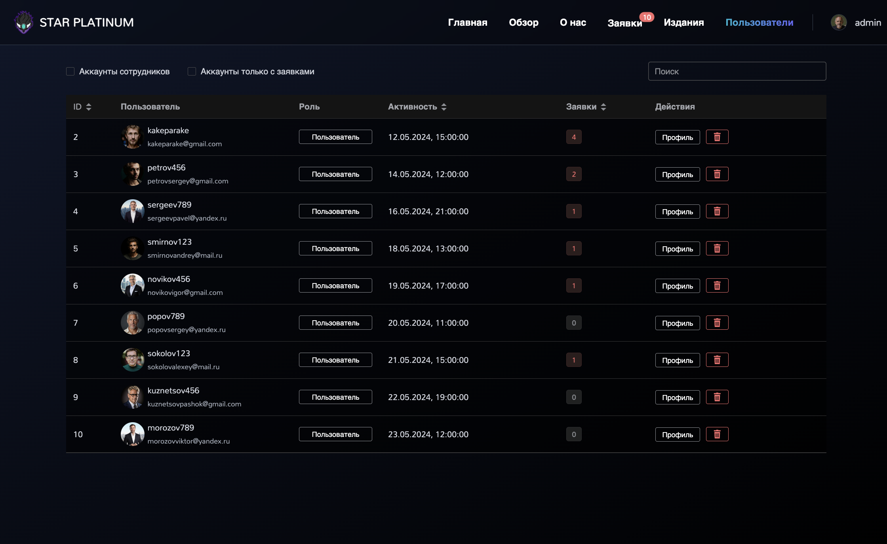

# My app for advertising agency

## The project

Users can submit applications and receive automatic feedback regarding the status of their applications via email. Additionally, users have the ability to access information about publications created by the administrator and incorporate it into their applications.

The administrator has a panel that enables them to oversee and manage applications and publications.

## Preview

### User screens






### Admin manage





## Technologies

- 🔭 Vue.js (3.2.37)
- 💫 Typescript
- ⚡ Vite (2.9.12)
- 🍍 Pinia (2.0.14)
- 🌈 Tailwind CSS (3.1.4)
- 💫 Vue Motion (@vueuse/motion)
- ✨ ESLint & Prettier
- 💫 Element UI
- ✨ Axios
- 🌈 AnimateCSS

_Find more information in the `package.json` file_

## Project setup and usage

Install dependencies:

```
npm install
```

Run development server:

```
npm run dev
```

## ENV

Install dependencies:

```
VITE_SERVER_URL=http://localhost:3000
```
